<h2 align="center">React Native TableView</h2>

<p align="center">Native iOS UITableView for React Native with JSON support</a>

<p align="center">
  <a href="https://www.npmjs.com/package/react-native-tableview">
    
  </a>
  <a href="https://www.npmjs.com/package/react-native-tableview">
    
  </a>
   <a href="#badge">
    
  </a>
</p>

## Contents

- [Features](#features)
- [Installation](#installation)
- [Styles](#supported-styles)
- [Examples](#examples)
- [Customization](#customization)

## Features

- Look and feel of iOS TableView - **because it is!** (with group/plain
  tableview type, sections headers, etc)
- Display long lists of data (like country list) with no performance loss
- Built-in accessory types (checkmark or disclosure indicator)
- Pull to refresh!
- Automatic scroll to initial selected value during component initialization
  (autoFocus property)
- Automatic item selection with "checkmark" with old item de-selection
  (optionally), see demo, useful to select country/state/etc.
- Render Native Section Index Titles (sectionIndexTitlesEnabled property)
- Native JSON support for datasource. If you need to display large dataset,
  generated Javascript will became very large and impact js loading time. To
  solve this problem the component could read JSON directly from app bundle
  without JS!
- Filter JSON datasources using NSPredicate syntax. For example you could select
  states for given country only (check demo)
- Create custom UITableView cells with flexible height using React Native syntax
  (TableView.Cell tag)
- Use TableView as menu to navigate to other screens (check included demo, using
  react-navigation https://reactnavigation.org)
- Native editing mode for table - move/delete option is supported by using
  attributes canMove, canEdit for items/sections

## Installation

Using npm:

```bash
npm install react-native-tableview --save
```

or using yarn:

```bash
yarn add react-native-tableview
```

> ⚠️ If you are on React Native < 0.60.0, you must use version 2.x.x of this library

### Pods

> If using CocoaPods or React Native version >= 0.60.0

```bash
cd ios && pod install && cd ..
```

### Linking

> For React Native <= 0.59 only

```bash
react-native link react-native-tableview
```

If fails, follow manual linking steps below,

#### Manual Linking

1. In XCode, in the project navigator, right click Libraries ➜ Add Files to
   [your project's name]
2. Add ./node_modules/react-native-tableview/RNTableView.xcodeproj
3. In the XCode project navigator, select your project, select the Build Phases
   tab and in the Link Binary With Libraries section add libRNTableView.a
4. And in the Build Settings tab in the Search Paths/Header Search Paths section
   add \$(SRCROOT)/../node_modules/react-native-tableview (make sure it's
   recursive).

## Supported Styles

### UITableView styles

These values are provided to the `tableViewStyle` prop.

```jsx
<TableView tableViewStyle={TableView.Consts.Style.Grouped}>
```

| Style   | Value                            | Preview                                      |
| ------- | -------------------------------- | -------------------------------------------- |
| Plain   | `TableView.Consts.Style.Plain`   | 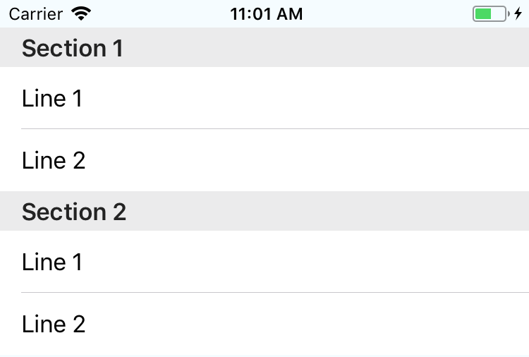   |
| Grouped | `TableView.Consts.Style.Grouped` |  |

### UITableViewCell styles

These values are provided to the `tableViewCellStyle` prop.

```jsx
<TableView tableViewCellStyle={TableView.Consts.CellStyle.Default}>
```

| Style    | Value                                 | Preview                                        |
| -------- | ------------------------------------- | ---------------------------------------------- |
| Default  | `TableView.Consts.CellStyle.Default`  | 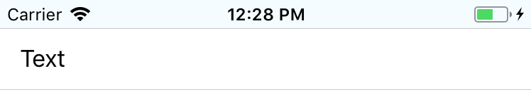  |
| Value1   | `TableView.Consts.CellStyle.Value1`   | 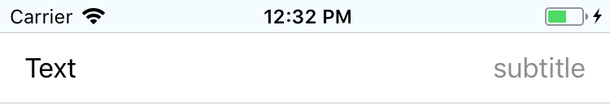   |
| Value2   | `TableView.Consts.CellStyle.Value2`   | 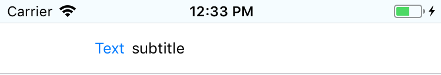   |
| Subtitle | `TableView.Consts.CellStyle.Subtitle` | 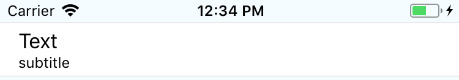 |

### Accessory types

These values are provided to the `accessoryType` prop on the `Item`.

```jsx
<Item accessoryType={TableView.Consts.AccessoryType.None}>
```

| Style                | Value                                                | Preview                                                   |
| -------------------- | ---------------------------------------------------- | --------------------------------------------------------- |
| None                 | `TableView.Consts.AccessoryType.None`                | 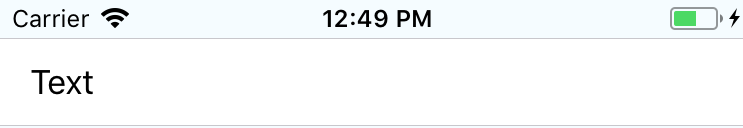                 |
| Disclosure Indicator | `TableView.Consts.AccessoryType.DisclosureIndicator` | 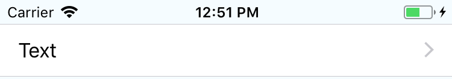 |
| Disclosure Button    | `TableView.Consts.AccessoryType.DisclosureButton`    | 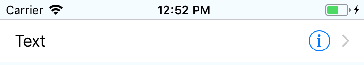    |
| Checkmark            | `TableView.Consts.AccessoryType.Checkmark`           | 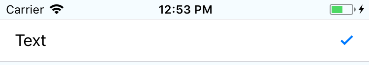            |
| Detail Button        | `TableView.Consts.AccessoryType.DetailButton`        | 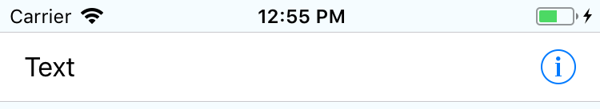        |

Disclosure Indicator can also be applied by adding the `arrow` prop on the
section.

```jsx
<Section arrow>
```

Checkmark can also be applied by adding the `selected` prop on the Item.

```jsx
<Item selected>
```

### Props

For a full list of props on all components check out
[the typescript definitions file](./src/index.d.ts).

### Methods

#### `scrollTo()`

Scrolls to a set of coordinates on the tableview.

```ts
/**
  * @param x Horizontal pixels to scroll
  * @param y Vertical pixels to scroll
  * @param animated With animation or not
  */
  scrollTo(x: number, y: number, animated: boolean): void;
```

#### `scrollToIndex()`

Scroll to an item in a section

```ts
/**
  * @param params scroll params
  * @param params.index index of the cell
  * @param params.section index of the section @default 0
  * @param params.animated scroll with animation @default true
  */
  scrollToIndex(params: { index: number, section?: number, animated?: boolean }): void;
```

### List item format

Items in the list can be either `TableView.Item` or `TableView.Cell`. An `Item`
is simply text. A `Cell` can be any complex component. However, only `Item`s can
be edited or moved. There are also issues with `Cell`s re-rendering on data
changes (#19) that can be avoided by using `Item`s. If you want to be able to
re-render, edit or move a complex component, use `reactModuleForCell`, described
in [Editable Complex Components](#editable-complex-components).

## Examples

### Smooth scrolling with large network loaded list


```jsx
() => {
  const [loading, setLoading] = useState(true);
  const [users, setUsers] = useState([]);

  useEffect(() => {
    const getUsers = async () => {
      const response = await fetch('https://randomuser.me/api/?results=5000');
      const data = await response.json();

      setLoading(false);
      setUsers(
        data.results.map(a => ({
          name: `${a.name.first} ${a.name.last}`,
          id: a.registered,
        }))
      );
    };

    getUsers();
  }, []);

  return (
    <View style={{ flex: 1 }}>
      <Text style={styles.title}>
        {loading ? 'Fetching' : 'Fetched'} 5000 users
      </Text>

      {loading && <ActivityIndicator />}

      <TableView
        style={{ flex: 1 }}
        tableViewCellStyle={TableView.Consts.CellStyle.Subtitle}
      >
        <Section>
          {users.map(a => (
            <Item key={a.id}>{a.name}</Item>
          ))}
        </Section>
      </TableView>
    </View>
  );
};
```

### App-bundled JSON with filter and selected value checkmarked

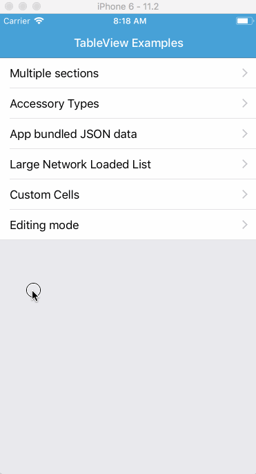

```jsx
// list spanish provinces and add 'All states' item at the beginning

const country = 'ES';

return (
  <View style={{ flex: 1 }}>
    <Text style={styles.title}>Showing States in Spain</Text>
    <TableView
      style={{ flex: 1 }}
      json="states"
      selectedValue="ES53"
      filter={`country=='${country}'`}
      tableViewCellStyle={TableView.Consts.CellStyle.Subtitle}
      onPress={event => alert(JSON.stringify(event))}
    />
  </View>
);
```

### Built-in editing

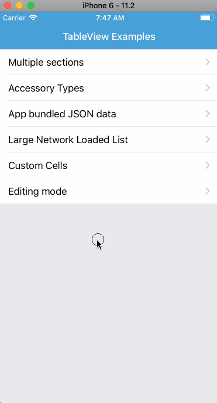

```jsx
render() {
  return (
    <View style={{ flex: 1 }}>
      <TableView
        style={{ flex: 1 }}
        editing={navigation.getParam('editing')}
      >
        <Section canMove canEdit>
          <Item canEdit={false}>Item 1</Item>
          <Item>Item 2</Item>
          <Item>Item 3</Item>
          <Item>Item 4</Item>
          <Item>Item 5</Item>
          <Item>Item 6</Item>
          <Item>Item 7</Item>
          <Item>Item 8</Item>
        </Section>
      </TableView>
    </View>
  )
}
```

### Pull to Refresh

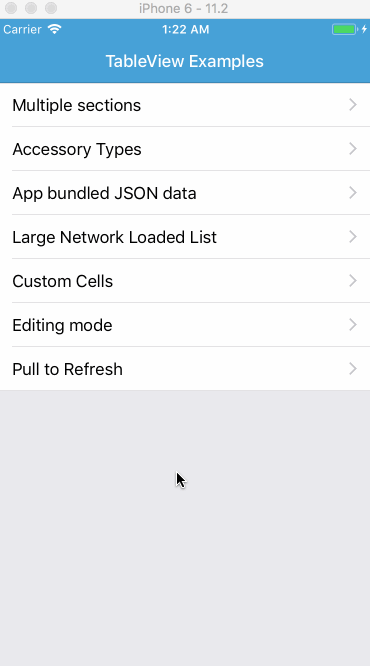

```jsx
function reducer(state, action) {
  switch (action.type) {
    case 'getUsers':
      return { ...state, loading: false, users: action.payload };
    case 'startRefresh':
      return { ...state, refreshing: true };
    case 'endRefresh':
      return {
        ...state,
        refreshing: false,
        amount: state.amount + 10,
        users: [...state.users, ...action.payload],
      };
    default:
      return state;
  }
}

() => {
  const [{ loading, amount, refreshing, users }, dispatch] = useReducer(
    reducer,
    {
      loading: true,
      users: [],
      refreshing: false,
      amount: 10,
    }
  );

  useEffect(() => {
    const getUsers = async () => {
      const data = await fetchUsers();
      dispatch({ type: 'getUsers', payload: data });
    };

    getUsers();
  }, []);

  const fetchUsers = async () => {
    const response = await fetch('https://randomuser.me/api/?results=10');
    const data = await response.json();

    return data.results.map(a => ({
      name: `${a.name.first} ${a.name.last}`,
      id: a.login.uuid,
    }));
  };

  const fetchMore = async () => {
    dispatch({ type: 'startRefresh' });
    const data = await fetchUsers();
    dispatch({ type: 'endRefresh', payload: data });
  };

  return (
    <View style={{ flex: 1 }}>
      <Text style={styles.title}>
        {loading ? 'Fetching' : 'Fetched'} {amount} users
      </Text>

      {loading && <ActivityIndicator />}

      <TableView
        style={{ flex: 1 }}
        tableViewCellStyle={TableView.Consts.CellStyle.Subtitle}
        canRefresh
        refreshing={refreshing}
        onRefresh={fetchMore}
      >
        <Section>
          {users.map(a => (
            <Item key={a.id}>{a.name}</Item>
          ))}
        </Section>
      </TableView>
    </View>
  );
};
}
```

## Customization

The following style props are supported:

- `tableViewCellStyle`
- `tableViewCellEditingStyle`
- `separatorStyle`
- `contentInset`
- `contentOffset`
- `scrollIndicatorInsets`
- `cellLayoutMargins`
- `cellSeparatorInset`

Colors:

- `textColor`
- `tintColor`
- `selectedTextColor`
- `detailTextColor`
- `separatorColor`
- `headerTextColor`
- `headerBackgroundColor`
- `footerTextColor`

Base font:

- `fontSize`
- `fontWeight`
- `fontStyle`
- `fontFamily`

"Subtitle" font:

- `detailFontSize`
- `detailFontWeight`
- `detailFontStyle`
- `detailFontFamily`

Header font:

- `headerFontSize`
- `headerFontWeight`
- `headerFontStyle`
- `headerFontFamily`

Footer font:

- `footerFontSize`
- `footerFontWeight`
- `footerFontStyle`
- `footerFontFamily`

## Images / Icons

An `Item` component takes an `image` and an optional `imageWidth` prop.

An `image` prop can be a string pointing to the name of an asset in your "Asset
Catalog". In this case an `imageWidth` prop is recommended.

```jsx
<Item image="icon-success.png" imageWidth={40} />
```

Alternatively, you can `require` the image from your local app code. In this case
an `imageWidth` is unnecessary.

```jsx
<Item image={require('../images/icon-success.png')} />
```

### Editable Complex Components

Only `Item`s can be edited or moved. However you can create a complex component
that is referenced by an Item using `reactModuleForCell`. You will need to do
several things to set this up.

1. Write your view component.
2. Pass the name of your view component as a prop in your `<TableView>`
   component.
3. Create a list of `<Item>`s in your TableView, passing props intended for your
   view component.
4. Register your view component as an `App` root view.

### Write your cell view component.

For example,

```jsx
//Should be pure... setState on top-level component doesn't seem to work

class TableViewExampleCell extends React.Component {
  render() {
    var style = { borderColor: '#aaaaaa', borderWidth: 1, borderRadius: 3 };

    // Fill the full native table cell height.
    style.flex = 1;

    // All Item props get passed to this cell inside this.props.data. Use them to control the rendering, for example background color:
    if (this.props.data.backgroundColor !== undefined) {
      style.backgroundColor = this.props.data.backgroundColor;
    }

    return (
      <View style={style}>
        <Text>
          section:{this.props.section},row:{this.props.row},label:
          {this.props.data.label}
        </Text>
        <Text> message:{this.props.data.message}</Text>
      </View>
    );
  }
}
```

For more examples, see examples/TableViewDemo.

#### Pass component as prop.

```jsx
<TableView reactModuleForCell="TableViewExampleCell" >
```

#### Create list of items, passing props

```jsx
<Section canEdit={true}>
  {this.props.items.map(function(item) {
    return (
      <Item
        key={'i' + item.data.date}
        label={item.label}
        message={item.message}
      />
    );
  })}
</Section>
```

Note that the props you pass must be primitive types: they cannot be objects.
Also, note that the props become properties of the `data` prop in your
`reactModuleForCell` component. That is, you pass `label="foo"` and in your
component you pick it up as `this.props.data.label`.

#### Register your component.

Each cell you render becomes a reuseable root view or `App`.

```js
var { AppRegistry } = React;

...

AppRegistry.registerComponent('TableViewExample', () => TableViewExample);
```

When debugging, you will see the message:

```
Running application "TableViewExample" with appParams: { /* params */ }. __DEV__ === true, development-level warning are ON, performance optimizations are OFF
```

multiple times. While slightly annoying, this does not seem to affect
performance. You may also see message
[Unbalanced calls start/end for tag 5](https://github.com/facebook/react-native/issues/4163).
